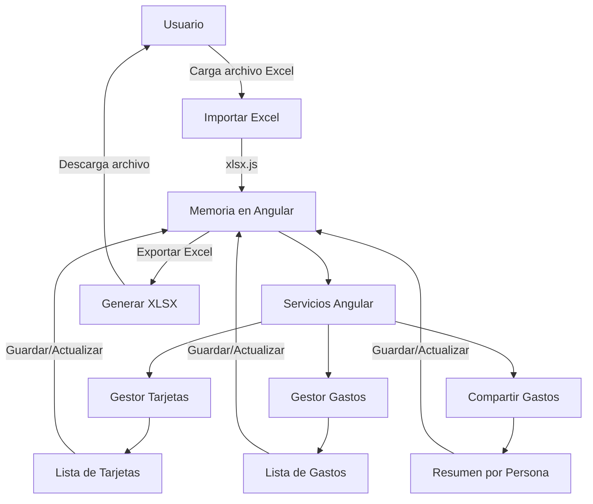

# Plan de Desarrollo – Gestor de Gastos de Tarjetas (Angular 19/20, sin Backend)

## Objetivo
Aplicación SPA (Single Page Application) para administrar gastos de tarjetas de crédito, soportando:
- Múltiples tarjetas.
- Gastos compartidos con otra persona.
- Exportación e importación de datos en Excel (como "base de datos").

## Tecnologías
- **Angular 19/20** con standalone components.
- **xlsx** → leer y escribir Excel en el navegador.
- **file-saver** → descarga de archivos.
- **uuid** → generación de IDs únicos.
- **Angular Material** (UI moderna).
- **Chart.js** (opcional para gráficos).

## Estructura de Carpetas
```
src/
 ├── app/
 │    ├── pages/
 │    │     ├── tarjetas/
 │    │     ├── gastos/
 │    │     ├── resumen/
 │    │     ├── importar-exportar/
 │    ├── services/
 │    ├── models/
 │    ├── utils/
 │    ├── app.routes.ts
 │    └── app.component.ts
 └── assets/
```

## Modelos
```ts
export interface Tarjeta {
  id: string;
  nombre: string;
  limite: number;
}

export interface Gasto {
  id: string;
  tarjetaId: string;
  descripcion: string;
  monto: number;
  fecha: string;
  compartidoCon?: string;
  porcentajeCompartido?: number;
}
```

## Reglas de negocio (resumen)
- Un gasto puede estar asociado a una única tarjeta (`tarjetaId`).
- Si el gasto es compartido, `compartidoCon` identifica a la otra persona y `porcentajeCompartido` define qué parte del monto se asigna a esa persona (ej.: 50 = mitad).
- El resumen debe mostrar totales por tarjeta y, opcionalmente, por persona (tenedor vs. compartido).
- Validar que `porcentajeCompartido` esté entre 0 y 100 cuando se marque como compartido.

## Funcionalidades
1. **Gestión de Tarjetas**: alta, baja, modificación.
2. **Gestión de Gastos**: alta, baja, modificación, filtrado por tarjeta y fecha.
3. **Compartir Gastos**: asignar porcentaje a otra persona.
4. **Resumen**: totales por tarjeta y persona, con gráficos.
5. **Exportar a Excel**: descarga en `.xlsx` de todos los datos.
6. **Importar desde Excel**: carga y reconstrucción de datos en memoria.
7. **Persistencia temporal**: guardar estado actual en `localStorage` para no perder cambios entre exports.

## Flujo de Datos


## Librerías a Instalar
```bash
npm install xlsx file-saver uuid @angular/material @angular/cdk chart.js
```

## Pasos de Desarrollo (Roadmap)
1. **Día 1-2** → Crear proyecto Angular + estructura de carpetas + modelos.
2. **Día 3-4** → CRUD tarjetas y gastos (en memoria, con Reactive Forms).
3. **Día 5** → Lógica para gastos compartidos (cálculo de proporciones en el resumen).
4. **Día 6-7** → Importar y exportar Excel.
5. **Día 8-9** → Implementar Angular Material y gráficos (totales por tarjeta/persona).
6. **Día 10** → Pruebas y optimizaciones (validaciones, UX, accesibilidad).

## Utilidades – Exportar Excel
```ts
import * as XLSX from 'xlsx';
import { saveAs } from 'file-saver';

export function exportToExcel(data: any[], fileName: string) {
  const worksheet = XLSX.utils.json_to_sheet(data);
  const workbook = XLSX.utils.book_new();
  XLSX.utils.book_append_sheet(workbook, worksheet, 'Datos');
  const excelBuffer = XLSX.write(workbook, { bookType: 'xlsx', type: 'array' });
  saveAs(new Blob([excelBuffer]), `${fileName}.xlsx`);
}
```

## Utilidades – Importar Excel
```ts
import * as XLSX from 'xlsx';

export function importFromExcel(file: File, callback: (data: any[]) => void) {
  const reader = new FileReader();
  reader.onload = (e) => {
    const binary = e.target?.result as string | ArrayBuffer;
    const workbook = XLSX.read(binary, { type: 'binary' });
    const sheetName = workbook.SheetNames[0];
    const data = XLSX.utils.sheet_to_json(workbook.Sheets[sheetName]);
    callback(data);
  };
  reader.readAsBinaryString(file);
}
```

## Consideraciones de Excel
- Guardar en **sheets separadas**: `Tarjetas`, `Gastos` (recomendado para claridad).
- Columnas mínimas:
  - **Tarjetas**: `id`, `nombre`, `limite`
  - **Gastos**: `id`, `tarjetaId`, `descripcion`, `monto`, `fecha(YYYY-MM-DD)`, `compartidoCon`, `porcentajeCompartido`
- Validar tipos y fechas al importar.

## Convenciones
- IDs: usar `uuid.v4()`.
- Fechas ISO (`YYYY-MM-DD`) para facilitar parse y filtros.
- Componentes standalone + rutas segmentadas por página.

## Entregables esperados
- SPA en Angular 19/20.
- Acciones: crear/editar/eliminar tarjetas y gastos, marcar gastos compartidos.
- Importar/Exportar Excel.
- Resumen con totales y (opcional) gráficos.
